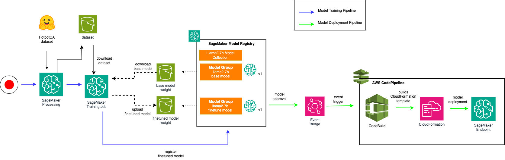

# Streamline LLM operations using Amazon SageMaker

## Getting started
This workshop is designed to help you operationalize an open source Large Language Model (LLM), and use the LLM to build a generative AI Q&A bot. Basically, this workshop is broken down into the following parts:

### Part 1: Finetune and operationalize an LLM

1. Register a base LLM model using SageMaker Model Registry

2. Finetune a Llama2 model with custom dataset using SageMaker Processing, Training and Inference using SageMaker Hosting.

3. Create an automated LLM training pipeline that orchestrates the LLM finetuning jobs using SageMaker Pipelines. Triggers an LLM deployment to production through CICD pipeline supported via CodePipeline.

4. Model Monitoring for LLM.

### Part 2: Build a generative AI Q&A Chatbot with RAG architecture on AWS

1. Deploy an Embedding Model through SageMaker Jumpstart. The embedding model will be used for creating embedding for the content to be stored in a vector database.

2. Build a vector database using Amazon OpenSearch serverless. Ingest content (news articles) into the vector database using langchain library. These content will be used in a retrieval Q&A bot to provide accurate answer based on user queries.

3. Build a fully functional Q&A chatbot using open source components. In particular, 1/ Amazon OpenSearch Serverless as a vector database for knowledge base repository. 2/ Open Sorce LLM (Llama2) to handle user queries, answers using natural language. 3/ Langchain framework for orchestrating the chat application. 4/ Streamlit framework to build a fully working chat user interface.

The following diagram depicts the building blocks used in the workshop:

## LLMOps Workshop 
This repository contains the materials and source codes required to complete the workshop. For instruction on how to get started, please refer to this [link](https://catalog.us-east-1.prod.workshops.aws/workshops/958877b7-af54-434e-8133-15bbb7693947):
