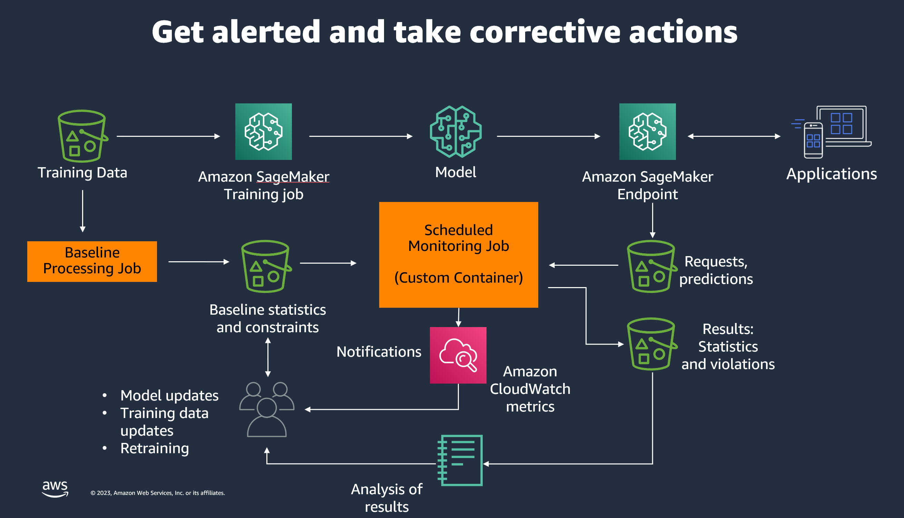

# Custom Model monitoring for Foundation Models with Amazon SageMaker Model Monitor

## Getting Started

This notebook shows how to:

1. Test custom monitoring script locally
2. Build a Docker container to include your custom drift algorithms
3. Monitor a live llama2 model endpoint for answer relevance

Amazon SageMaker enables you to capture the input, output and metadata for invocations of the models that you deploy. It also enables you to bring your own metrics to analyze the data and monitor its quality. In this notebook, you learn how Amazon SageMaker enables these capabilities.

## Prerequisite

To get started, make sure you have these prerequisites completed.

1. Complete lab2 where you hosted a fine tuned Llama 2 model and enabled data capture on the live endpoint.
2. Add **Amazon Bedrock permission** to SageMaker Execution Role
3. Add [**AmazonEC2ContainerRegistryFullAccess**](https://docs.aws.amazon.com/aws-managed-policy/latest/reference/AmazonEC2ContainerRegistryFullAccess.html) policy to SageMaker Execution Role to access ECR

You will need to provide jsonl data captures which was created in lab2 to be able to run the notebooks. 
* Use [ragas_framework notebook](ragas_framework.ipynb) to study MDD (Metrics-Driven Development) for llm to create custom metrics for monitoring and for the purposes of completing lab3, you can run [lab3-custom-monitoring-for-llm notebook](lab3-custom-monitoring-for-llm.ipynb). 
* You can find out more information related to the concept of [Metrics-Driven Development](https://docs.ragas.io/en/latest/concepts/metrics_driven.html). 

## Metrics-Driven Development

Here in this lab we build custom metrics to monitor the performance of the llm on answer relevancy and using this metric schedule a SageMaker Model Monitoring job. 

The following diagram depicts the building blocks used in this lab:

